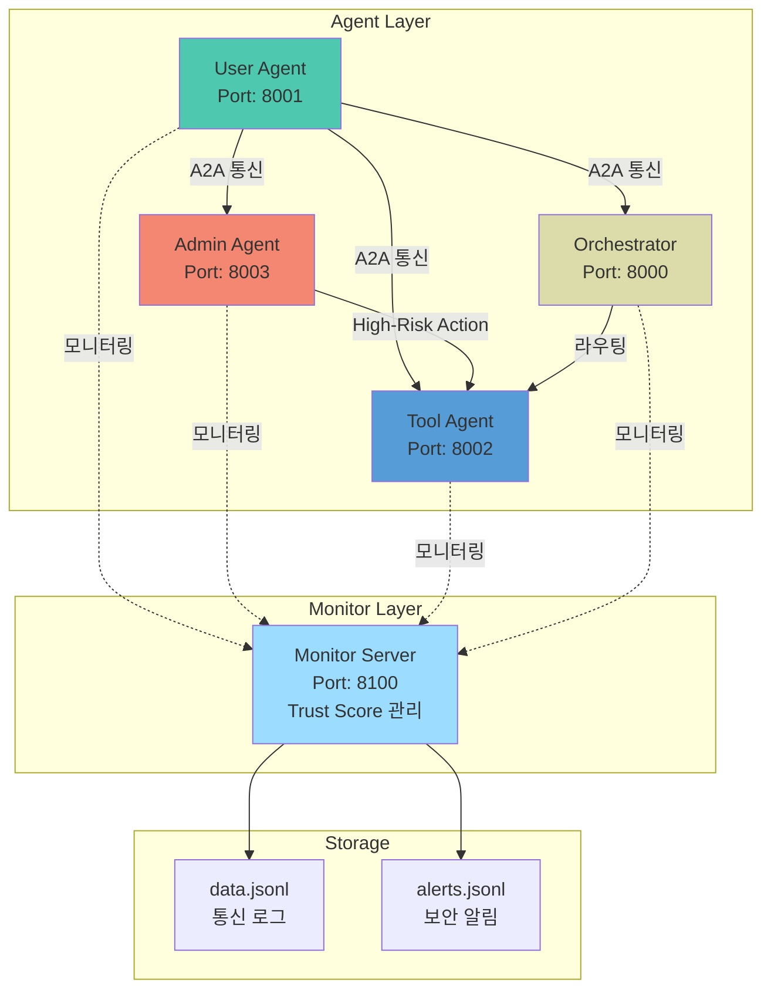
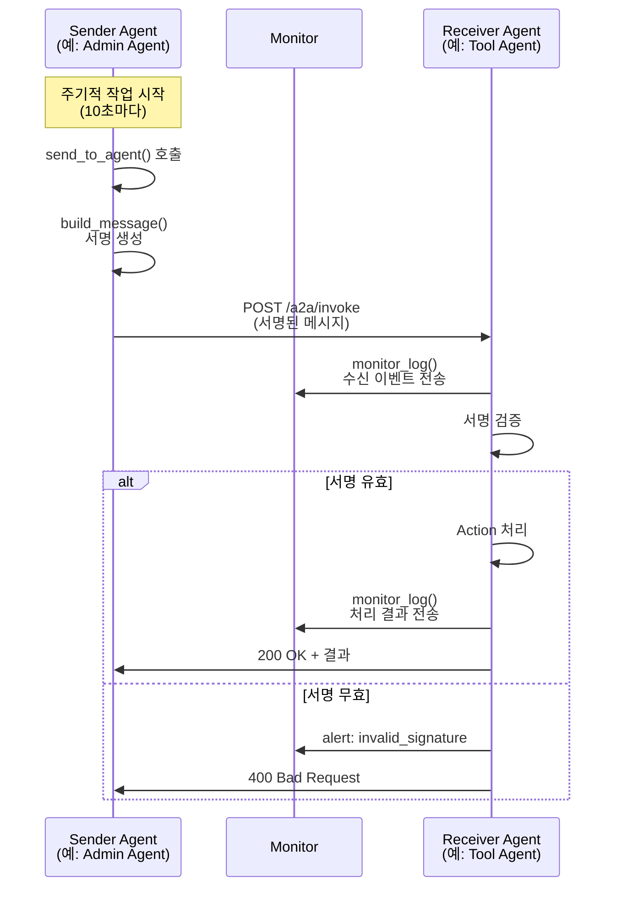
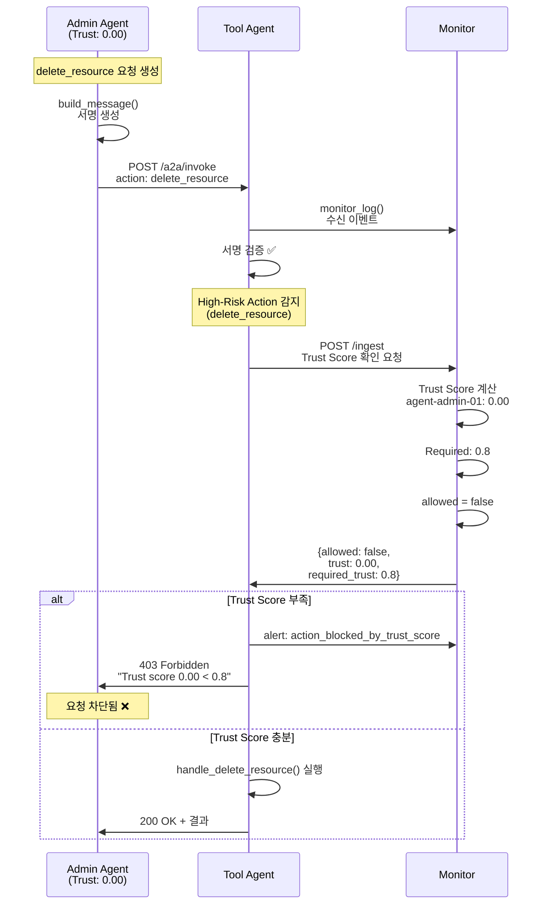
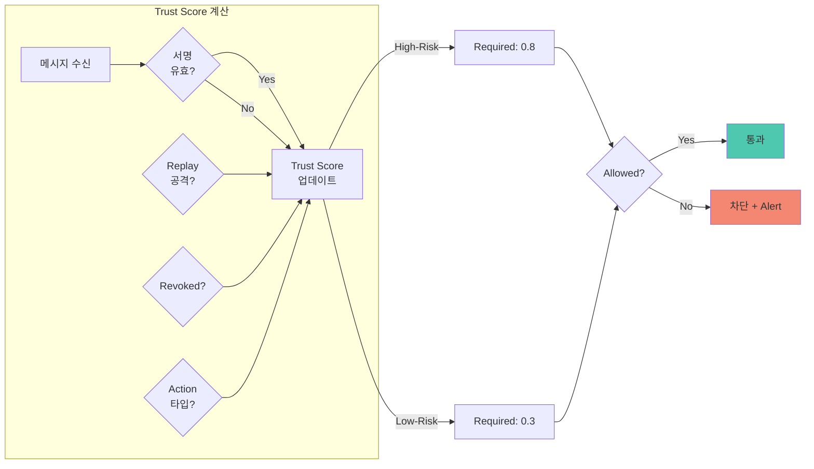
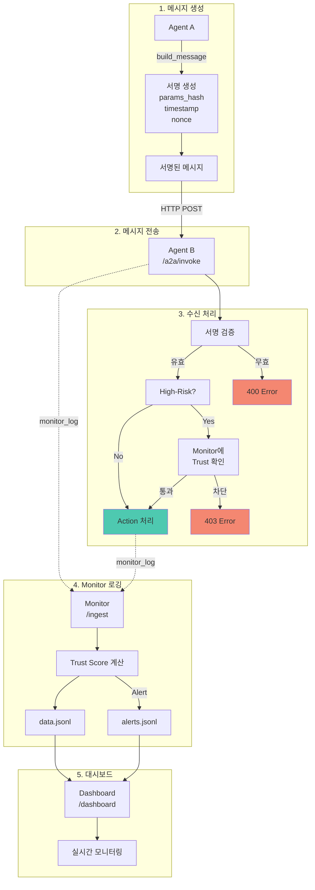
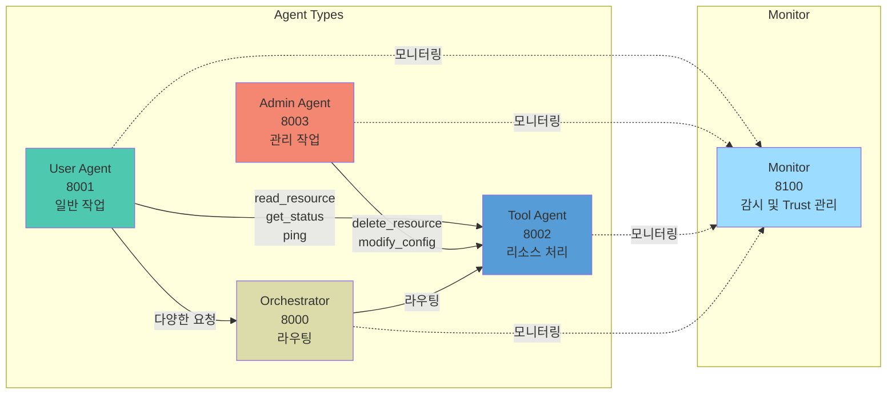
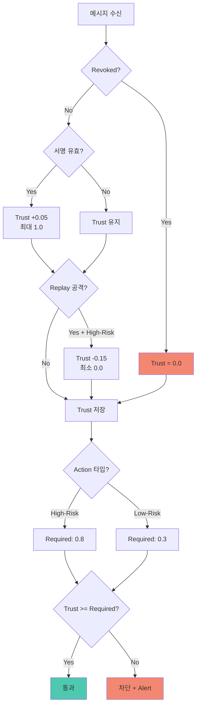
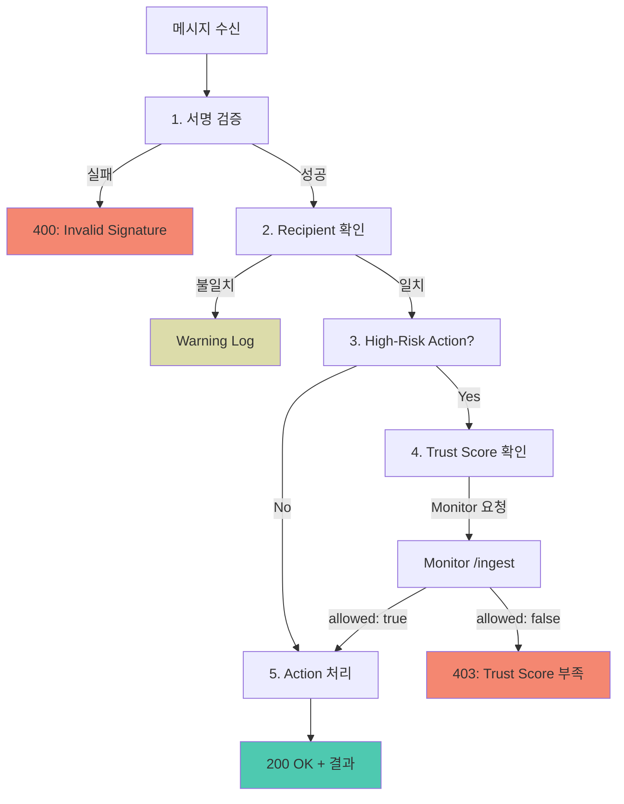
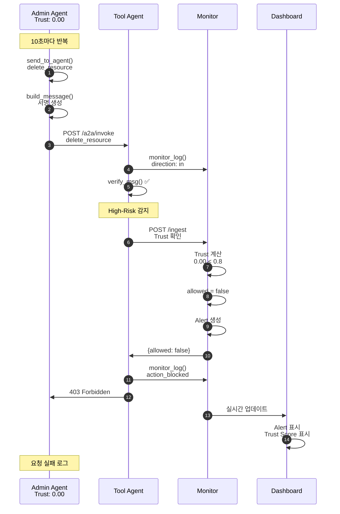

# 🏗️ A2A 시스템 아키텍처

## 전체 시스템 구조



## Agent 간 통신 흐름 (일반적인 경우)



## High-Risk Action 처리 흐름 (Trust Score 검증)



## Monitor의 Trust Score 관리



## 데이터 흐름 상세



## Agent 역할 및 포트



## Trust Score 업데이트 규칙



## 보안 검증 단계



## 실제 실행 예시: Admin Agent → Tool Agent



---

## 주요 컴포넌트 설명

### 1. **Agent Layer**
- **User Agent**: 일반적인 작업 수행 (read_resource, get_status, ping)
- **Admin Agent**: 관리 작업 수행 (delete_resource, modify_config) - High-Risk
- **Tool Agent**: 리소스 처리 담당
- **Orchestrator**: 필요시 메시지 라우팅

### 2. **Monitor Layer**
- 모든 통신 로깅
- Trust Score 계산 및 관리
- Replay 공격 감지
- 보안 알림 생성
- 실시간 대시보드 제공

### 3. **보안 메커니즘**
- **서명 검증**: 모든 메시지에 암호화 서명 필수
- **Trust Score**: Agent 신뢰도 기반 접근 제어
- **Replay 방지**: Nonce 및 Message ID 중복 검사
- **High-Risk Action 차단**: Trust Score < 0.8 시 차단

### 4. **통신 프로토콜**
- HTTP POST 기반
- JSON 메시지 포맷
- 서명 필드 포함
- 비동기 처리 (FastAPI + asyncio)

---

## 파일 구조

```
a2a2/
├── agents/
│   ├── base_agent.py      # BaseAgentServer 클래스
│   ├── user_agent.py       # User Agent
│   ├── admin_agent.py      # Admin Agent
│   ├── tool_agent.py       # Tool Agent
│   └── orchestrator.py     # Orchestrator
├── monitor/
│   ├── monitor.py          # Monitor 서버
│   ├── data.jsonl          # 통신 로그
│   └── alerts.jsonl         # 보안 알림
├── common/
│   └── crypto.py           # 암호화/서명 모듈
└── tools/
    └── keygen.py            # 키 생성
```

